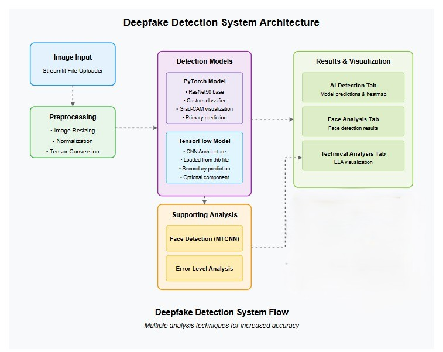
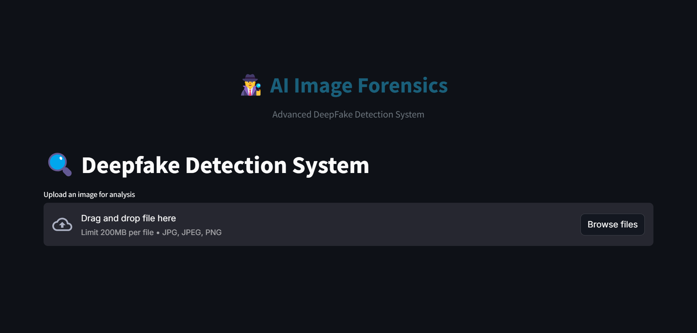
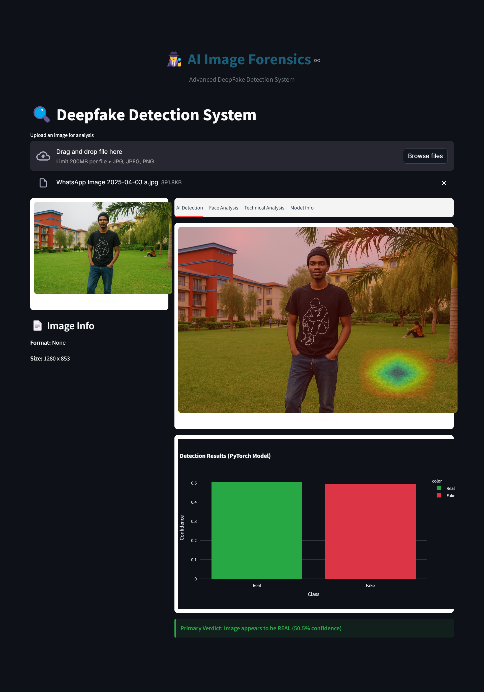
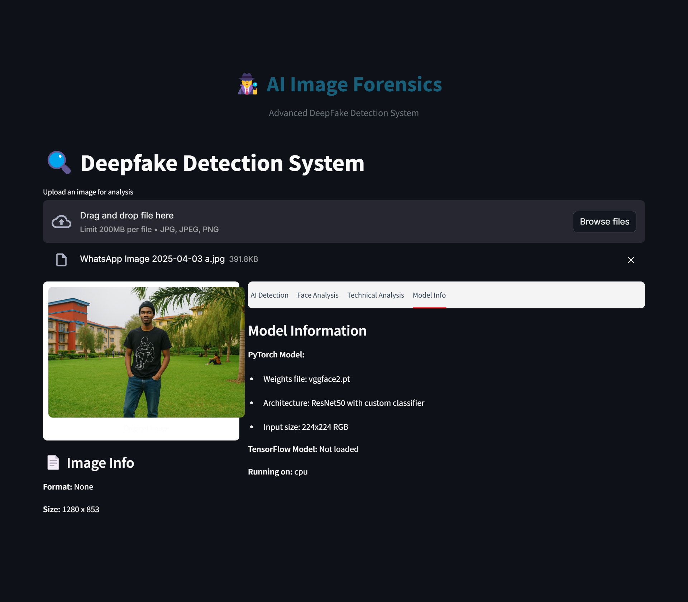

# Deepfake Detection System

This application uses deep learning models to detect potentially manipulated or "deepfake" images. It provides a user-friendly web interface for image analysis with multiple detection methods.











## Features

- **Multi-model detection**: Uses both PyTorch and TensorFlow models for more reliable results
- **Visualization tools**: Heatmap generation showing areas of interest in detection
- **Face detection**: Automatically identifies and analyzes faces in images
- **Error Level Analysis (ELA)**: Reveals inconsistencies in image compression
- **User-friendly interface**: Easy-to-use web application built with Streamlit

## System Requirements

- Python 3.8 or higher
- 4GB RAM minimum (8GB recommended)
- GPU support is optional but recommended for faster processing
- 500MB free disk space for models and code

## Installation

### Step 1: Extract the ZIP file

Extract the compressed ZIP file to a location on your computer. This will create a folder named `deepfake-detector` containing all necessary files.

### Step 2: Set up a Python environment

It's recommended to use a virtual environment to avoid conflicts with other Python packages:

```bash
# Navigate to the extracted folder
cd path/to/deepfake-detector

# Create a virtual environment
python -m venv venv

# Activate the virtual environment
# On Windows:
venv\Scripts\activate
# On macOS/Linux:
source venv/bin/activate
```

### Step 3: Install dependencies

Install all required packages using pip:

```bash
pip install -r requirements.txt
```

This will install all necessary libraries including:
- streamlit
- torch
- torchvision
- tensorflow
- opencv-python
- pillow
- matplotlib
- plotly
- facenet-pytorch

The installation may take several minutes depending on your internet connection.

## Running the Application

### Step 1: Ensure models are in place

The ZIP file includes two pre-trained models:
- `cnn_model.h5` (TensorFlow model)
- `vggface2.pt` (PyTorch face weights)

Verify that these files are in the main application directory.

### Step 2: Start the Streamlit app

With your virtual environment activated, run:

```bash
streamlit run app.py
```

This will start the web application and automatically open it in your default web browser. If it doesn't open automatically, the terminal will display a URL (typically http://localhost:8501) that you can copy and paste into your browser.

## Using the Application

1. **Upload an image**: Click the "Upload an image for analysis" button to select an image from your computer.

2. **View the analysis**: Once uploaded, the app will automatically process the image and show the results in several tabs:

   - **AI Detection**: Shows the prediction results (Real/Fake), confidence scores, and a heatmap highlighting regions of interest
   - **Face Analysis**: Displays detected faces in the image
   - **Technical Analysis**: Shows Error Level Analysis (ELA) which can reveal inconsistencies in image compression
   - **Model Info**: Provides technical information about the detection models

3. **Interpret the results**: The app will provide a verdict on whether the image appears to be real or fake, along with a confidence percentage.

## Troubleshooting

### Common Issues

1. **"CUDA not available" message**
   - This is normal if you don't have a compatible NVIDIA GPU
   - The application will fall back to using CPU which is slower but still functional

2. **Model loading errors**
   - Ensure the model files are in the same directory as the application
   - Check file permissions to ensure the app can read the model files

3. **Missing dependencies**
   - If you encounter "ModuleNotFoundError", run `pip install -r requirements.txt` again
   - Some systems may require additional system libraries for OpenCV

4. **Application crashes or freezes**
   - Larger images may require more memory; try using smaller images
   - Ensure your system meets the minimum requirements

### GPU Support

To enable GPU acceleration (if you have a compatible NVIDIA GPU):

1. Ensure you have the appropriate NVIDIA drivers installed
2. Install the CUDA-enabled versions of PyTorch and TensorFlow:
   ```bash
   pip install torch torchvision torchaudio --extra-index-url https://download.pytorch.org/whl/cu117
   pip install tensorflow-gpu
   ```

## Technical Details

### Model Architecture

- **PyTorch Model**: Based on ResNet50 with custom classifier heads and Grad-CAM visualization
- **TensorFlow Model**: CNN architecture loaded from the H5 file

### Detection Methods

- **Deep Learning Classification**: Primary method using neural networks
- **Error Level Analysis (ELA)**: Reveals differences in compression levels
- **Face Detection**: Identifies and analyzes faces using MTCNN

## Privacy Note

All processing happens locally on your machine. No images are uploaded to external servers for analysis.

## License

This software is provided for educational and research purposes only. See the LICENSE file for more details.

## Contact

If you encounter any issues or have questions, please contact [Your Contact Information].